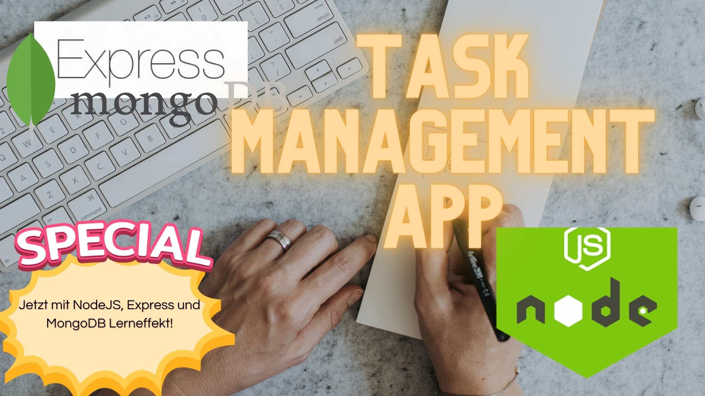

# Aufbau eines Task-Tracking-Systems

## Hintergrund:
Unser Team braucht ein einfacheres, effektiveres Werkzeug, um unsere täglichen Aufgaben zu verfolgen. Daher haben wir uns entschieden, unser eigenes, an unsere Bedürfnisse angepasstes Task-Tracking-System zu erstellen. Das System soll uns bei der Organisation unserer Aufgaben helfen und unseren Workflow verbessern.

Wir wollen alle Tasks sehen können nach Status und auch neue Tasks erstellen können. Im ersten Schritt ist uns das Backend am wichtigsten und wir wollen später ein Frontend hinzufügen. 

## Lernziel:
Das primäre Lernziel besteht darin, den Umgang mit Node.js, Express und MongoDB zu vertiefen und zu festigen. Durch die praktische Anwendung dieser Technologien beim Aufbau eines eigenen Task-Tracking-Systems wird das Verständnis dieser Tools und deren Zusammenspiel verbessert.

## Aufgabenbeschreibung:

### Schritt 1: 
Initialisiere ein neues Node.js-Projekt und installiere die erforderlichen Abhängigkeiten (Express, Mongoose).

### Schritt 2: 
Erstelle ein einfaches Express-Server-Setup, das auf Anfragen auf dem Port 3000 hört.

### Schritt 3: 
Stelle eine Verbindung zu einer MongoDB Atlas-Datenbank her. Stelle sicher, dass die Verbindung funktioniert.

### Schritt 4: 
Erstelle ein Mongoose-Schema für die Aufgaben. Jede Aufgabe sollte folgende Informationen enthalten:

- **Titel** (String, erforderlich)
- **Beschreibung** (String, optional)
- **Erstellungsdatum** (Datum, standardmäßig auf das aktuelle Datum gesetzt)
- **Fälligkeitsdatum** (Datum, optional)
- **Status** (String, standardmäßig auf "offen" gesetzt, andere mögliche Werte: "in Bearbeitung", "erledigt")

### Schritt 5: 
Implementiere GET und POST Operationen für Aufgaben unter `/tasks` .

### Schritt 6: 
Erstelle eine einfache Middleware-Funktion, die alle Anfragen in der Console protokolliert (URL, HTTP-Methode, Datum und Uhrzeit der Anfrage).

Beispiel `[2023-06-21T17:27:04.180Z] POST /tasks
Kleine Anfangshilfe: `app.use((req, res, next) => { const now = new Date().toISOString(); ....`

### Schritt 7: Optional, aber wirklich cool
Erstelle eine `index.html` file und eine `fetch.js` datei. Implementiere einen Button der mit fetch unsere `/tasks API anspricht` und die Ergebnisse im Browser auflistet

Implementiere einen Button für `/get` und ein für `/post`

### Schritt 99: Sehr cool
Cool, bau doch gleich ein kleines Frontend. Hier sind dir keine Grenzen gesetzt. Nur sei so cool und stell dein Projekt dann am nächsten Tag vor. Du hast es dir verdient. :) 
